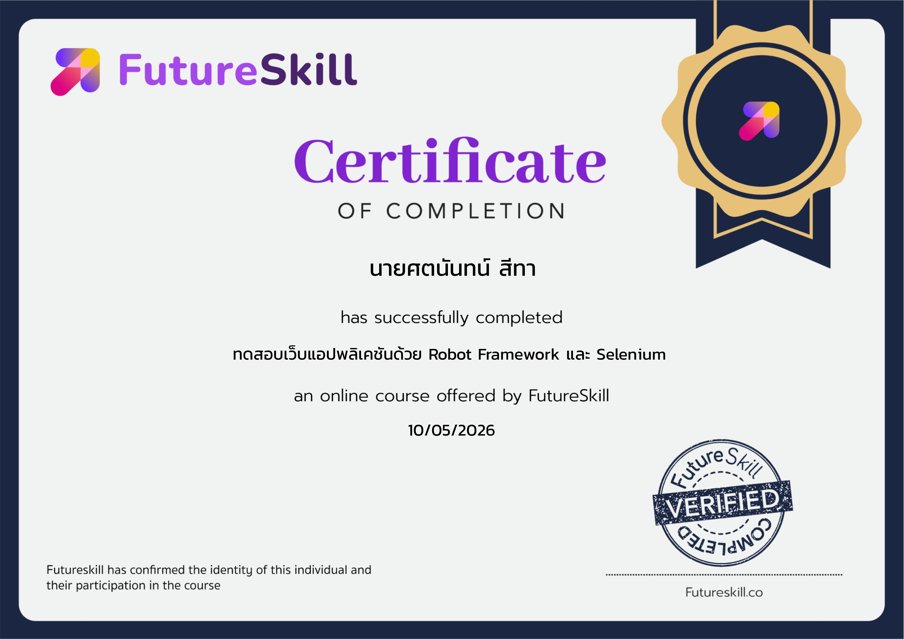
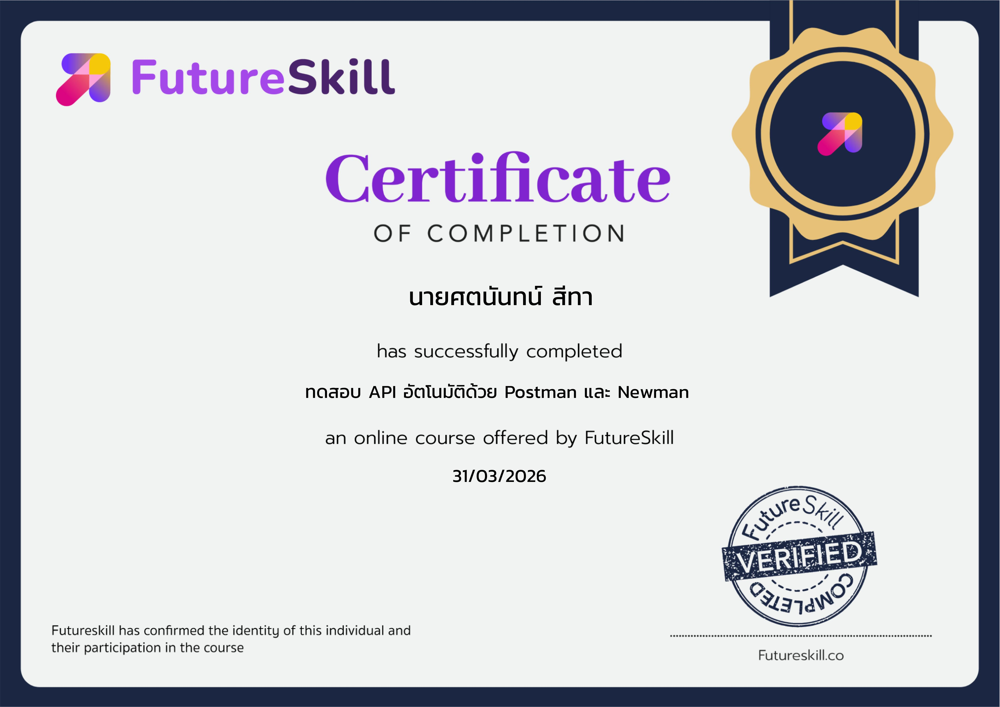
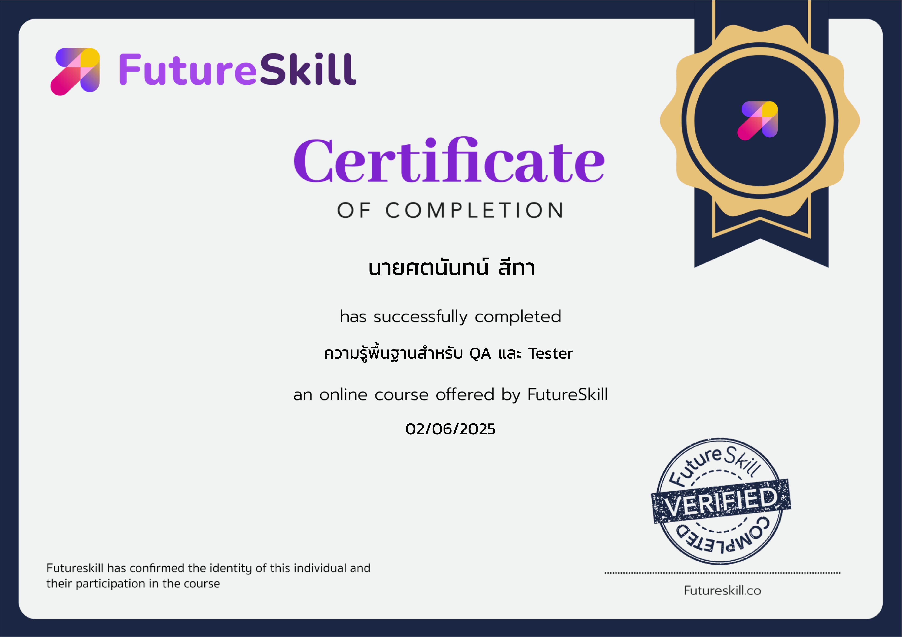

# QA-Software-Testing-Certifications

## 🏆 Professional Certifications
Featured here is my collection of professional certifications and course completions, specializing in both Manual and Automation Software Testing.

---

### 🤖 Automation & API Testing

* **Testing web applications with Robot Framework and Selenium** - FutureSkill | 2026
  
  

* **Automate API testing with Postman and Newman** - FutureSkill | 2026
  
  

* **Workshop API and Functional Manual Test** - FutureSkill | 2025
  
  

### 📝 Manual Testing

* **Fundamental Knowledge for QA and Testers** - FutureSkill | 2025
  
  

---
